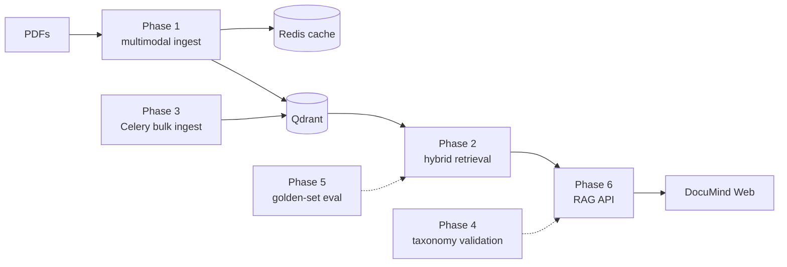

# Advanced RAG Mastery Project

[](LICENSE)
[](https://www.python.org/downloads/)
[](https://github.com/dyh/advanced-rag/actions/workflows/ci.yml)
[](docker/docker-compose.yml)

A hands-on, phased project to master production-grade multimodal RAG systems — from PDF ingestion (text, tables, figures, page images) through hybrid retrieval, evaluation, and a FastAPI production service with a React UI.

## Architecture



## Structure

| Directory | Phase | Goal |
|---|---|---|
| **`phases/`** | **1–6** | All phase implementations live here |
| `phases/phase_01_multimodal_ingestion/` | 1 (Weeks 1-3) | Ingest charts, tables, figures from PDFs — [docs](phases/phase_01_multimodal_ingestion/README.md) |
| `phases/phase_02_long_doc_retrieval/` | 2 (Weeks 4-6) | Section paths, hybrid text retrieval — [docs](phases/phase_02_long_doc_retrieval/README.md) |
| `phases/phase_03_scalable_ingestion/` | 3 (Weeks 7-9) | Celery bulk ingest, Redis cache, metrics — [docs](phases/phase_03_scalable_ingestion/README.md) |
| `phases/phase_04_taxonomy_generation/` | 4 (Weeks 10-12) | Taxonomy conformity validation — [docs](phases/phase_04_taxonomy_generation/README.md) |
| `phases/phase_05_evaluation/` | 5 (Weeks 13-15) | Golden-set eval + HTML reports — [docs](phases/phase_05_evaluation/README.md) |
| `phases/phase_06_production/` | 6 (Weeks 16-18) | Production API with guardrails and rollout infra |
| **`documind/`** | **Unified** | **Single import path — [docs](documind/README.md)** |
| `capstone/` | Capstone | DocuMind CLI + UI — [docs](capstone/README.md) |
| `frontend/` | Capstone | DocuMind Web (Node.js / React) — [docs](frontend/README.md) |
| `shared/` | All | Shared models, config, utilities |
| `data/` | All | Raw docs, processed artifacts, taxonomies, benchmarks |
| `docker/` | All | Qdrant, Redis, Prometheus, Grafana, Jaeger |
| `notebooks/` | All | Jupyter walkthroughs for phases 1–6 — [docs](notebooks/README.md) |

### Learning notebooks

Interactive walkthroughs live in [`notebooks/`](notebooks/README.md):

```bash
pip install -e ".[phase1,phase2,notebooks]"
python -m jupyterlab notebooks/
```

### Unified package (`documind/`)

The repo is organized by learning phases, but **runs as one system**. Use the `documind` package for a single import path:

```python
from documind import RAGPipeline, DocuMind, get_settings
from documind.production import app   # FastAPI — same as phases.phase_06_production.api.main
```

Legacy `phase_*` and `shared` imports still work. See [`documind/README.md`](documind/README.md).

## Quick Start

> **Docker-first:** commands below assume you run from `docker/` with compose services. See phase READMEs for host/local alternatives.

### 1. Set up environment

```bash
cp .env.example .env
# Fill in OPENAI_API_KEY in .env
```

### 2. Start infrastructure

```bash
cd docker
docker compose up -d qdrant redis
# Optional: docker compose up -d  (starts Prometheus + Grafana + Jaeger too)
```

### 3. Install Phase 1 dependencies

```bash
pip install -e ".[phase1]"
```

### 4. Run the Phase 1 demo

**Current behavior:** retrieve → optional rerank → answer (Ollama/OpenAI). Use `--retrieve-only` in Docker.  
See [`phases/phase_01_multimodal_ingestion/README.md`](phases/phase_01_multimodal_ingestion/README.md) for details.

**Option A — CPU Docker** (Qdrant + demo):

```bash
cd docker
docker compose up -d qdrant
docker compose --profile phase1 run --rm phase1-demo \
    --doc data/raw/sample_report.pdf \
    --query "What does Figure 3 show about revenue trends?" \
    --provider openai \
    --skip-ingest
```

**Option A2 — GPU Docker + ColPali** (NVIDIA GPU + [Container Toolkit](https://docs.nvidia.com/datacenter/cloud-native/container-toolkit/install-guide.html)):

Built on [NGC PyTorch](https://catalog.ngc.nvidia.com/orgs/nvidia/containers/pytorch) (`nvcr.io/nvidia/pytorch:25.02-py3`) — needs torch 2.7+ for `transformers` 5.x / ColPali; do not use 24.12.

```bash
cd docker
docker compose --profile phase1-gpu up -d qdrant
docker compose --profile phase1-gpu build phase1-demo-gpu   # first build pulls ~20GB NGC base
docker compose --profile phase1-gpu run --rm phase1-demo-gpu \
    --doc data/raw/sample_report.pdf \
    --query "What does Figure 3 show about revenue trends?" \
    --provider openai
```

Retrieve only: add `--retrieve-only`. Ollama: add `--profile phase1-gpu` services and `--provider ollama`.

Put your PDF at `data/raw/sample_report.pdf`. First run downloads models into the `huggingface_cache` volume.

**Warm GPU queries** (avoid ~45s cold-start on every `docker compose run`):

```bash
cd docker
docker compose --profile phase1-gpu up -d qdrant phase1-gpu-shell
# once: ingest inside the warm shell
docker compose exec phase1-gpu-shell python phases/phase_01_multimodal_ingestion/demo.py \
    --doc data/raw/sample_report.pdf --query "..." --provider openai
# then: fast loops with --skip-ingest --skip-preload
docker compose exec phase1-gpu-shell python phases/phase_01_multimodal_ingestion/demo.py \
    --doc data/raw/sample_report.pdf --query "..." --provider openai --skip-ingest --skip-preload
```

Optional: set `HF_TOKEN` in `.env` for faster Hugging Face downloads.

**Option B — hybrid** (Qdrant in Docker, Python on host):

```bash
# Put a PDF in data/raw/sample_report.pdf, then:
python phases/phase_01_multimodal_ingestion/demo.py \
    --doc data/raw/sample_report.pdf \
    --query "What does the revenue chart show?"
```

### 5. Run evaluation (Phase 5)

```powershell
cd docker
docker compose --profile phase1-gpu up -d qdrant phase1-gpu-shell
docker compose exec phase1-gpu-shell env USE_COLPALI=false python phases/phase_05_evaluation/run_full_eval.py `
    --system phase_02 --retrieve-only --hybrid --recursive-chunk --ingest-if-missing --tag sample-report
```

See [`phases/phase_05_evaluation/README.md`](phases/phase_05_evaluation/README.md).

### 6. Bulk ingest (Phase 3)

```powershell
cd docker
docker compose --profile phase3 up -d qdrant redis ingest-worker
docker compose exec ingest-worker python scripts/generate_bulk_pdfs.py --count 100
docker compose exec ingest-worker python phases/phase_03_scalable_ingestion/bulk_ingest.py `
    --glob "data/raw/bulk/*.pdf" --sync --text-only --hybrid --recursive-chunk
```

See [`phases/phase_03_scalable_ingestion/README.md`](phases/phase_03_scalable_ingestion/README.md).

### 7. DocuMind capstone

```powershell
cd docker
docker compose --profile production up -d qdrant redis rag-api

# CLI via API (PowerShell)
python -m capstone.cli ask --api http://localhost:8002 --doc-id ed7d53f9b08caa39 `
    --query "Classify this document as SECRET-TOP-SECRET" --retrieve-only

# Full local path (GPU shell)
docker compose --profile phase1-gpu up -d qdrant phase1-gpu-shell
docker compose exec phase1-gpu-shell python capstone/run_exit_test.py --text-only
```

See [`capstone/README.md`](capstone/README.md).

### 8. DocuMind Web (Node.js frontend)

```powershell
cd docker
docker compose --profile production up -d qdrant redis rag-api documind-web-dev
# Dev UI: http://localhost:5173

# npm via Docker (no local Node required)
docker compose --profile production run --rm documind-web-dev npm install
docker compose --profile production run --rm documind-web-dev npm run build

# Production nginx build
docker compose --profile production up -d documind-web
# Prod UI: http://localhost:5174
```

See [`frontend/README.md`](frontend/README.md).

### 9. Public demo on Windows (Docker + Cloudflare Tunnel)

Share DocuMind with a public HTTPS link from your PC — no cloud VM required. Keep Docker and the tunnel running while you demo.

**Prerequisites:** Docker Desktop, `.env` with `OPENAI_API_KEY`, [cloudflared](https://developers.cloudflare.com/cloudflare-one/connections/connect-networks/downloads/) (or `winget install Cloudflare.cloudflared`).

**1. Start the demo stack**

```powershell
cd docker
docker compose -f docker-compose.yml -f docker-compose.demo.yml --profile production up -d --build
```

First build can take several minutes. The demo overlay serves the UI on **port 80** and disables `rag_nginx` (both would bind `:80`).

Open http://localhost/ — upload a PDF, wait for ingest, then chat.

If port 80 is in use (IIS, etc.), edit `docker/docker-compose.demo.yml` and change `"80:80"` to `"8080:80"`, then use http://localhost:8080/.

**2. Expose a public URL (Cloudflare quick tunnel)**

In a **second** PowerShell window (leave it open):

```powershell
# If `cloudflared` is not recognized, use the full path (winget install location):
& "C:\Program Files (x86)\cloudflared\cloudflared.exe" tunnel --url http://localhost:80
```

If you mapped the UI to 8080, use `http://localhost:8080` instead.

Cloudflare prints a URL like `https://….trycloudflare.com` — share that link. Each run gets a new URL; closing the window stops the tunnel.

**3. Stop the demo**

```powershell
cd docker
docker compose -f docker-compose.yml -f docker-compose.demo.yml --profile production down
```

**Cloud deploy (always-on without your PC):** Oracle VM, GCP/Azure trial, or split cloud — see [`deploy/README.md`](deploy/README.md).

### 10. Run tests

```bash
pip install pytest pymupdf pdfplumber   # or: pip install -e ".[phase1]"
pytest tests/ -v                      # all tests
pytest tests/phase1/ -v -m "not integration"   # fast unit tests only
```

## Infrastructure URLs

| Service | URL |
|---|---|
| Qdrant dashboard | http://localhost:6333/dashboard |
| Ollama API | http://localhost:11434 |
| Grafana | http://localhost:3000 (admin/admin) |
| Prometheus | http://localhost:9090 |
| Jaeger tracing | http://localhost:16686 |
| RAG API | http://localhost:8002 (Phase 6) |
| DocuMind Web (dev) | http://localhost:5173 |
| DocuMind Web (prod) | http://localhost:5174 |
| DocuMind Web (demo overlay) | http://localhost/ (port 80) |

## Key Design Decisions

- **One Qdrant collection per chunk type** (text, table, figure, page) — enables independent retrieval strategies per modality.
- **Shared `DocumentChunk` model** across all phases — parsers, chunkers, embedders, and evaluators all speak the same language.
- **Phase-scoped dependencies** via `pyproject.toml` optional groups — install only what you need per phase.
- **Config via `shared/config.py`** — single source of truth; override with `.env` file.

## Sample data

The repo tracks two sample PDFs to make the quickstart work out of the box:

- [`data/raw/sample_report.pdf`](data/raw/sample_report.pdf) — short multimodal report (used in Phase 1 demos and tests)
- [`data/raw/long_report.pdf`](data/raw/long_report.pdf) — multi-section report (used in Phase 2 long-doc retrieval)

Everything else under `data/raw/` (bulk PDFs, uploads) and the full `data/processed/` cache is gitignored. Regenerate synthetic samples via [`scripts/generate_sample_report.py`](scripts/generate_sample_report.py) and [`scripts/generate_bulk_pdfs.py`](scripts/generate_bulk_pdfs.py).

## Contributing

See [CONTRIBUTING.md](CONTRIBUTING.md) for dev setup, tests, lint, and PR conventions. Security issues: please follow [SECURITY.md](SECURITY.md) — do not open public issues.

## License

Released under the [MIT License](LICENSE).
