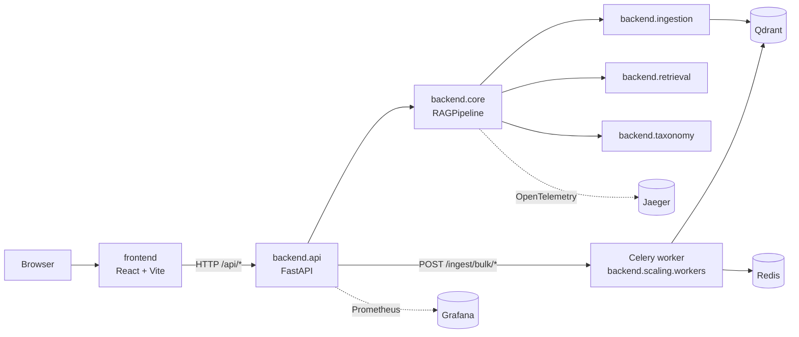

# DocuMind

[](LICENSE)
[](https://www.python.org/downloads/)
[](https://github.com/dyh1265/RAG/actions/workflows/ci.yml)
[](docker/docker-compose.yml)
[](https://github.com/dyh1265/RAG/wiki)
[](docs/documind-book.pdf)

Upload a PDF, chat with it, get cited answers. Production-grade multimodal RAG over text, tables, and figures — with hybrid retrieval, taxonomy conformity checks, PII redaction, and an OpenTelemetry-instrumented FastAPI backend.

> Looking for the long-form deep dive? See [**DocuMind — The Complete Reference**](docs/documind-book.pdf) (42-page PDF, regenerated from the repo via `python scripts/generate_book.py`).

## Demo


<table>
<tr>
<td></td>
<td></td>
<td></td>
</tr>
<tr>
<td align="center"><sub>Upload &amp; index a PDF</sub></td>
<td align="center"><sub>Ask, get a cited answer</sub></td>
<td align="center"><sub>Jump to the source page</sub></td>
</tr>
</table>

> Capture instructions live in [`docs/images/README.md`](docs/images/README.md).

## Architecture



## Layout

| Path | What |
|---|---|
| [`backend/`](backend/) | Python package — single import root |
| `backend/api/` | FastAPI app (`backend.api.main:app`), routers, schemas, guardrails, monitoring, load tests |
| `backend/core/` | Shared config, models, RAG pipeline orchestrator |
| `backend/ingestion/` | Ingest-time: PDF/table/figure parsers, OCR, text/image/ColPali embedders, Qdrant store |
| `backend/retrieval/` | Query-time retrieval: chunking + enrichment, hybrid (BM25+dense), parent-expand, cross-encoder + FlashRank rerankers, multimodal fusion |
| `backend/generation/` | Query-time answer synthesis (OpenAI / Ollama backends) |
| `backend/scaling/` | Celery bulk-ingest workers, Redis cache, dedup, fingerprinting |
| `backend/taxonomy/` | RDF taxonomy validation, conformity hooks, fuzzy entity linking |
| [`frontend/`](frontend/) | React + Vite UI (chat, citations, document admin, bulk upload) |
| [`docker/`](docker/) | Compose stack: Qdrant, Redis, Prometheus, Grafana, Jaeger, API, worker, web |
| [`tests/`](tests/) | Pytest suite mirroring `backend/` layout |
| [`data/`](data/) | `raw/` (PDFs, gitignored except samples), `processed/` (cache), `taxonomies/` (RDF) |
| [`deploy/`](deploy/) | Public-demo guides for Oracle/Fly/Cloudflare/GCP |
| [`scripts/`](scripts/) | Synthetic PDF generators for the demo |

## Quickstart

### 1. Set the API key

```bash
cp .env.example .env
# edit .env and set OPENAI_API_KEY=sk-...
```

### 2. Start everything in Docker

CPU (default, works on any host):

```bash
cd docker
docker compose --profile production up -d --build
```

GPU (requires NVIDIA GPU + driver, plus the [NVIDIA Container Toolkit](https://docs.nvidia.com/datacenter/cloud-native/container-toolkit/latest/install-guide.html) on Linux or Docker Desktop with WSL2 GPU support on Windows):

```bash
cd docker
docker compose -f docker-compose.yml -f docker-compose.gpu.yml --profile production up -d --build
```

First CPU build downloads PyTorch + spaCy + Presidio (~3 GB). The GPU build adds the CUDA PyTorch wheels (~5 GB total). On a 4 GB+ VM the CPU build takes 10–15 min; the GPU build needs roughly the same on bandwidth and a host that already has the NVIDIA toolkit configured.

Verify GPU is actually wired up (after the GPU stack is up):

```bash
docker compose exec rag-api python -c "import torch; print(torch.cuda.is_available(), torch.cuda.device_count())"
# expected: True 1   (False 0 means torch is CPU-only — rebuild without cached layers)
```

The same compose layout drives local use, public demos (Cloudflare Tunnel), and Oracle/GCP/Fly VMs. Only the web container exposes a public port (`80`); Qdrant, Redis, and the API bind to `127.0.0.1`.

| Service | URL |
|---|---|
| Web UI (SPA + `/api` proxy) | **http://localhost** |
| Backend API (loopback) | http://localhost:8002/health |
| Qdrant dashboard (loopback) | http://localhost:6333/dashboard |
| Grafana | http://localhost:3000 (admin/admin) |
| Prometheus | http://localhost:9090 |
| Jaeger tracing | http://localhost:16686 |

For frontend hot reload in Docker use the `dev` profile instead:

```bash
docker compose --profile dev up -d --build   # Vite at http://localhost:5173
```

### 3. Use it

Open http://localhost → upload [`data/raw/sample_report.pdf`](data/raw/sample_report.pdf) → ask "What does Figure 3 show about revenue trends?".

## Backend dev

```bash
python -m venv .venv
.venv\Scripts\Activate.ps1            # Windows; macOS/Linux: source .venv/bin/activate
pip install -e ".[dev]"

# Run the API locally (needs Qdrant + Redis from docker compose)
( cd docker && docker compose up -d qdrant redis )
uvicorn backend.api.main:app --reload --port 8002

# Run the Celery worker
celery -A backend.scaling.workers.celery_app worker --loglevel=info --concurrency=1

# Tests + lint
pytest tests/ -m "not integration" -v
ruff check .

# RAG quality eval (needs Qdrant; answer tests need OPENAI_API_KEY)
( cd docker && docker compose up -d qdrant )
python scripts/generate_sample_report.py    # only needed once; PDF is tracked
pytest tests/eval/test_metrics.py -v
pytest tests/eval/ -m eval -v
```

## Frontend dev

```bash
cd frontend
npm install
npm run dev   # http://localhost:5173, proxies /api/* to http://localhost:8002
```

Or in Docker with hot reload:

```bash
cd docker
docker compose --profile dev up -d --build   # Vite at http://localhost:5173
```

Build for production:

```bash
npm run build   # outputs dist/
```

## Configuration

All backend settings live in [`backend/core/config.py`](backend/core/config.py) and can be overridden in `.env`. Common toggles:

| Env var | Default | What it does |
|---|---|---|
| `OPENAI_API_KEY` | _required_ | OpenAI generation + embeddings |
| `USE_HYBRID` | `true` | BM25 + dense retrieval fusion |
| `USE_RECURSIVE_CHUNKER` | `true` | Token-aware splitter |
| `USE_COLPALI` | `false` | Page-image embeddings (needs GPU) |
| `USE_TAXONOMY_VALIDATION` | `true` | Block answers that violate the RDF taxonomy in `data/taxonomies/` |
| `USE_PII_REDACTION` | `true` | Presidio + spaCy redaction on query and ingest |
| `USE_OCR` | `true` | Tesseract OCR for image-only PDF pages |
| `API_WARMUP_MODELS` | `true` | Eager model load on boot (slower start, faster first query) |
| `CORS_ALLOW_ORIGINS` | `*` | Comma-separated allowed origins. Use `*` for local/demo; set explicit origins in production. |

## Benchmarks

Retrieval quality is enforced as a hard gate in CI on every push and on a
weekly schedule. The numbers below are the **minimum thresholds** that the
[`tests/eval/`](tests/eval/) suite must clear against
[`tests/eval/golden_set.jsonl`](tests/eval/golden_set.jsonl) — a hand-curated
golden set of questions paired with the pages they should retrieve from
[`data/raw/sample_report.pdf`](data/raw/sample_report.pdf).

| Metric | CI-enforced minimum | What it measures |
|---|---|---|
| Recall@5 | ≥ **0.70** | Fraction of relevant pages retrieved in top-5 |
| Hit@5 | ≥ **0.80** | At least one relevant page in top-5 |
| MRR | ≥ **0.50** | Mean reciprocal rank of the first relevant hit |
| Keyword coverage | ≥ **0.66** | Required keywords present in the generated answer |
| Faithfulness | ≥ **0.85** | Ragas faithfulness (opt-in, `pip install -e ".[eval]"`) |
| p95 retrieval latency | ≤ **60 000 ms** | Retrieve-only wall clock after warmup (CPU runner) |

Thresholds are sourced from
[`backend/core/config.py`](backend/core/config.py) (`EVAL_*` env vars) so
the same numbers gate CI, scheduled evals, and local runs. The scheduled
[RAG Eval workflow](.github/workflows/eval.yml) writes a Markdown summary
of the actual measured numbers to the GitHub Actions run page on every run.

Reproduce locally:

```bash
( cd docker && docker compose up -d qdrant )
python scripts/generate_sample_report.py   # one-off, PDF is also tracked
pytest tests/eval/test_retrieval.py tests/eval/test_metrics.py -m eval -v
```

The latency budget is intentionally generous so CPU-only CI runners pass.
On a modern laptop with the sample report indexed, retrieval typically
clears p95 ≤ 1 500 ms even with hybrid + parent-expand on. Raise / lower
the bar via `EVAL_RETRIEVAL_LATENCY_P95_MS`.

## Cleanup

```bash
cd docker

# Stop containers, keep volumes (Qdrant data, Redis, Grafana, model cache)
docker compose --profile production --profile dev down

# Stop and drop orphans (e.g. legacy rag_nginx after a refactor)
docker compose --profile production --profile dev down --remove-orphans

# Wipe everything: containers, network, named volumes — fresh slate next start
docker compose --profile production --profile dev down -v --remove-orphans

# Reclaim build cache + unused images / networks (whole-host scope)
docker system prune -f
docker builder prune -f
```

| Volume | Holds | Drop with `down -v`? |
|---|---|---|
| `qdrant_data` | All ingested chunks + embeddings | yes |
| `redis_data` | Embedding cache + Celery queue | yes |
| `prometheus_data`, `grafana_data` | Metrics + dashboards | yes |
| `huggingface_cache` | Downloaded models (~3 GB) | yes (next start re-downloads) |
| `documind_node_modules` | Frontend dev deps | yes |

Project workspace cleanup:

```bash
# Drop ingest cache + processed PDFs (keeps tracked sample PDFs)
git clean -fdX data/processed/ data/raw/

# Pytest + ruff caches
rm -rf .pytest_cache .ruff_cache
# Windows: Remove-Item -Recurse -Force .pytest_cache, .ruff_cache
```

## Sample data

[`data/raw/sample_report.pdf`](data/raw/sample_report.pdf) is tracked for the quickstart and the eval golden set. Everything else under `data/raw/` and all of `data/processed/` is gitignored. Regenerate the sample with [`scripts/generate_sample_report.py`](scripts/generate_sample_report.py); produce a folder of bulk-ingest PDFs with [`scripts/generate_bulk_pdfs.py`](scripts/generate_bulk_pdfs.py) (writes to `data/raw/bulk/`).

## Public demo

See [`deploy/README.md`](deploy/README.md) for Oracle/Fly/Cloudflare/GCP options. Bare minimum: a 4 GB VM + the same Docker stack.

## Learn more

The [project Wiki](https://github.com/dyh1265/RAG/wiki) is the long-form companion to this README. Recommended reading order:

- [Architecture](https://github.com/dyh1265/RAG/wiki/Architecture) — service topology and request flow.
- [RAG Pipeline](https://github.com/dyh1265/RAG/wiki/RAG-Pipeline) — every stage from parse to answer, with code references.
- [Retrieval](https://github.com/dyh1265/RAG/wiki/Retrieval) — hybrid BM25 + dense, multimodal RRF fusion, parent expansion, rerankers, ColPali.
- [Evaluation](https://github.com/dyh1265/RAG/wiki/Evaluation) — golden set, metrics, CI gates.
- [Configuration](https://github.com/dyh1265/RAG/wiki/Configuration) — full env-var reference.

Source for the wiki lives at [`docs/wiki/`](docs/wiki/) and auto-publishes on every push to `master` via the [Wiki Sync workflow](.github/workflows/wiki.yml).

## Contributing

See [CONTRIBUTING.md](CONTRIBUTING.md). Security issues: [SECURITY.md](SECURITY.md).

## License

[MIT](LICENSE).
