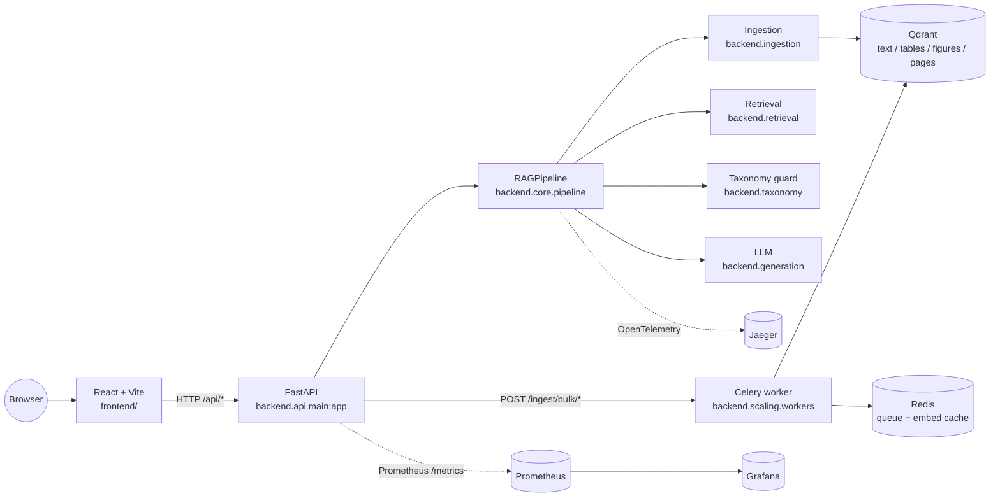

# Architecture

DocuMind is split into a stateless API layer, a stateful retrieval layer, a worker tier for bulk ingest, and an observability sidecar. Each piece is a separate container in the [Docker Compose stack](https://github.com/dyh1265/RAG/tree/master/docker) so they can be scaled or replaced independently.

## Service topology

## What each component is responsible for

| Component | Path | Responsibility |
|---|---|---|
| **Frontend** | [`frontend/`](https://github.com/dyh1265/RAG/tree/master/frontend) | Chat UI, citation rendering, document preview, bulk upload progress. Vite dev or nginx in prod. |
| **API** | [`backend/api/`](https://github.com/dyh1265/RAG/tree/master/backend/api) | FastAPI routers (`query`, `ingest`, `bulk_ingest`, `admin`, `health`), rate limiting (`slowapi`), PII guardrails, CORS, OTLP. |
| **Pipeline** | [`backend/core/pipeline.py`](https://github.com/dyh1265/RAG/blob/master/backend/core/pipeline.py) | Single `RAGPipeline` entry point. The API, eval suite, and worker all go through it instead of wiring components by hand. |
| **Ingestion** | [`backend/ingestion/`](https://github.com/dyh1265/RAG/tree/master/backend/ingestion) | PDF/table/figure parsers, OCR (Tesseract via `pytesseract`), text + image + ColPali embedders, Qdrant store. |
| **Retrieval** | [`backend/retrieval/`](https://github.com/dyh1265/RAG/tree/master/backend/retrieval) | Hybrid BM25 + dense, multimodal RRF fusion, parent-chunk expansion, cross-encoder + FlashRank rerankers, chunk filters. |
| **Generation** | [`backend/generation/answer_generator.py`](https://github.com/dyh1265/RAG/blob/master/backend/generation/answer_generator.py) | OpenAI + Ollama backends, citation building, fallback when the LLM is unreachable. |
| **Scaling** | [`backend/scaling/`](https://github.com/dyh1265/RAG/tree/master/backend/scaling) | Celery bulk-ingest tasks, Redis embedding cache, fingerprint-based dedup. |
| **Taxonomy** | [`backend/taxonomy/`](https://github.com/dyh1265/RAG/tree/master/backend/taxonomy) | RDF taxonomy validation, conformity checking, fuzzy entity linking. Can warn or hard-block forbidden answers. |
| **Vector DB** | Qdrant | Four collections: `text_chunks`, `table_chunks`, `figure_chunks`, `page_chunks` (only created if ColPali is on). |
| **Queue + cache** | Redis | Celery broker for bulk jobs, embed cache keyed on chunk fingerprint. |
| **Observability** | Prometheus, Grafana, Jaeger | `/metrics` scrape, dashboards, OTLP traces for ingest + retrieval. |

## Request flow: a single-question query

1. Browser → `POST /api/query` (FastAPI, rate-limited by `slowapi`).
2. The router validates the `QueryRequest`, runs PII redaction on the query if enabled.
3. `RAGPipeline.query(...)` runs the full multimodal retrieval (see [Retrieval](Retrieval)).
4. `AnswerGenerator` builds the cited prompt and calls OpenAI or Ollama.
5. The taxonomy guard inspects the answer; if `TAXONOMY_BLOCK_FORBIDDEN=true`, forbidden classifications cause a structured refusal instead of the model output.
6. `QueryResponse` (answer + citations + latency) goes back to the browser; OTLP spans land in Jaeger.

## Request flow: bulk PDF ingest

1. Browser → `POST /api/ingest/bulk/folder` with up to N files (default cap 2000/min per IP).
2. The router enqueues a Celery task per PDF onto Redis.
3. Workers (`backend.scaling.workers`) pull tasks, fingerprint each PDF, dedup against an in-process LSH cache plus the Qdrant content hash, and call `RAGPipeline.ingest` for new docs.
4. Workers publish progress to Redis (`bulk:job:{id}:status`) and emit Prometheus metrics on the `INGEST_METRICS_PORT`.
5. Browser polls `GET /api/ingest/bulk/{job_id}` and renders the progress bar.

## Why these boundaries

- **API ⇄ pipeline**: keeping the FastAPI layer thin means the same `RAGPipeline` runs in the eval harness, the Celery worker, and the API without any duplication. Tests don't have to spin up FastAPI.
- **Worker ⇄ API**: bulk ingest can saturate a CPU for minutes. Putting it on Celery + Redis means a single PDF upload from the chat UI can't get queued behind a 500-PDF batch.
- **Four Qdrant collections**: text, tables, figures, and (optional) page images are embedded by different models and retrieved with different query hints. One collection per modality keeps the search index dense and the fusion logic in [`MultiModalRetriever`](https://github.com/dyh1265/RAG/blob/master/backend/retrieval/multimodal_retriever.py) explicit.
- **OpenTelemetry**: the same trace ID propagates from the FastAPI request through the embedder and back, which makes "why was that query slow?" answerable from Jaeger without bisecting the code.

## Configuration surface

Every toggle lives in [`backend/core/config.py`](https://github.com/dyh1265/RAG/blob/master/backend/core/config.py) (`pydantic-settings`). See [Configuration](Configuration) for the full list. The defaults are tuned for the in-tree sample report; production deployments override them via `.env`.
