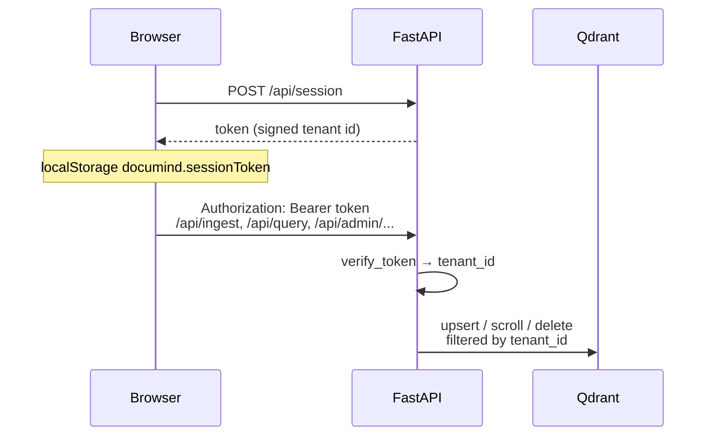

# Sessions & document isolation

DocuMind is a **single-tenant deployment** (one Qdrant, one API process) but supports **many anonymous visitors** on a shared URL — for example a Cloudflare Tunnel demo. Each browser gets its own document corpus. Visitors cannot list, query, delete, or preview another visitor's PDFs unless they forge a valid session token.

There are no user accounts, passwords, or server-side session stores. Isolation is **stateless**: an HMAC-signed token embeds an unguessable tenant id; Qdrant payloads are stamped with that id at ingest and filtered at read time.

## How it works

1. **First visit** — [`frontend/src/storage/session.ts`](https://github.com/dyh1265/DocuMind/blob/master/frontend/src/storage/session.ts) calls `POST /api/session` (nginx proxies `/api/*` to the FastAPI app at `/session`) if there is no cached token. The API mints a random 32-hex `tenant_id`, signs it, and returns `{"token": "...", "tenant_id": "..."}`. The UI stores only the token in `localStorage` under `documind.sessionToken`.
2. **Every API call** — [`frontend/src/api/client.ts`](https://github.com/dyh1265/DocuMind/blob/master/frontend/src/api/client.ts) sends `Authorization: Bearer <token>` via `authHeaders()`.
3. **Resolution** — [`get_tenant_id`](https://github.com/dyh1265/DocuMind/blob/master/backend/api/dependencies.py) in `backend/api/dependencies.py` verifies the signature and expiry, then returns the embedded tenant id. Invalid or expired tokens get **401**.
4. **Storage** — Ingest (single-file SSE and Celery bulk) passes `tenant_id` into [`RAGPipeline.ingest`](https://github.com/dyh1265/DocuMind/blob/master/backend/core/pipeline.py); [`QdrantStore`](https://github.com/dyh1265/DocuMind/blob/master/backend/ingestion/stores/qdrant_store.py) writes `tenant_id` on every point payload. Query adds `filters={"tenant_id": ...}` so retrieval never crosses tenants. Admin list/delete/source-path and bulk job status are scoped the same way.

### Token format

Implementation: [`backend/api/sessions.py`](https://github.com/dyh1265/DocuMind/blob/master/backend/api/sessions.py). The token is **not** a JWT dependency — it is `<base64url(payload)>.<base64url(hmac-sha256)>` where the payload is `{"t":"<tenant_id>","iat":<unix_ts>}`. No PII is carried; possession of the token is the only credential.

| Case | `get_tenant_id` result |
|---|---|
| No `Authorization` header and no `t` query param | `public` — CLI, eval harness, curl without a token |
| Valid signed token | Tenant id from payload |
| Token present but bad signature or past `SESSION_MAX_AGE_SECONDS` | HTTP **401** |

### PDF preview (`?t=`)

Browser `<iframe src="...">` cannot set custom headers. For document preview URLs, the client appends the session token as a query parameter: `?t=<token>`. The same `_extract_token` helper accepts either `Bearer` or `t`.

## What is scoped

| Surface | Scoped by tenant? |
|---|---|
| `POST /api/ingest`, `POST /api/ingest/stream` | Yes — vectors stamped at upsert |
| `POST /api/query`, `POST /api/query/stream` | Yes — retrieval filter |
| `GET /api/admin/documents`, delete, source PDF | Yes |
| `POST /api/ingest/bulk/*`, job poll/cancel | Yes — job record stores `tenant_id`; workers inherit it |
| `POST /api/session` | No — mints a **new** tenant every call (client only calls once per browser profile) |

Bulk jobs created before session support, or ingests run without a token, land under tenant **`public`**. Everyone sharing the default dev secret still shares `public` unless they use the UI (which always mints a token).

## Configuration

| Env var | Default | What |
|---|---|---|
| `SESSION_SECRET` | `documind-dev-secret-change-me` | HMAC key for signing tokens. **Override with a long random value** (`openssl rand -hex 32`) on any shared or public URL; otherwise anyone who knows the default can forge tokens and read other tenants' data. |
| `SESSION_MAX_AGE_SECONDS` | `2592000` (30 days) | Token lifetime from `iat`. Set `0` to disable expiry checks. |

See also the [README configuration table](https://github.com/dyh1265/DocuMind#configuration) and [deploy guide](https://github.com/dyh1265/DocuMind/blob/master/deploy/README.md) for production tunnel setups.

## Operations notes

- **Existing Qdrant data** indexed before tenant support has no `tenant_id` payload (or only `public`). Those points are invisible to browsers with a private token until you re-ingest or wipe volumes (`docker compose down -v` in dev).
- **Not multi-user auth** — there is no login, roles, or admin override across tenants. For true multi-tenant SaaS you would add identity, per-tenant Qdrant collections or clusters, and stricter secrets management.
- **Rate limits** remain **per IP** (`slowapi`), not per session. A single NAT can still hit shared upload caps.

## Code map

| Piece | Path |
|---|---|
| Mint / verify | [`backend/api/sessions.py`](https://github.com/dyh1265/DocuMind/blob/master/backend/api/sessions.py) |
| `POST /session` (browser: `/api/session`) | [`backend/api/routers/session.py`](https://github.com/dyh1265/DocuMind/blob/master/backend/api/routers/session.py) |
| FastAPI dependency | [`backend/api/dependencies.py`](https://github.com/dyh1265/DocuMind/blob/master/backend/api/dependencies.py) |
| Frontend bootstrap | [`frontend/src/storage/session.ts`](https://github.com/dyh1265/DocuMind/blob/master/frontend/src/storage/session.ts) |
| Qdrant payload + filters | [`backend/ingestion/stores/qdrant_store.py`](https://github.com/dyh1265/DocuMind/blob/master/backend/ingestion/stores/qdrant_store.py) |

Tests: [`tests/api/test_sessions.py`](https://github.com/dyh1265/DocuMind/blob/master/tests/api/test_sessions.py), [`tests/api/test_tenant_isolation.py`](https://github.com/dyh1265/DocuMind/blob/master/tests/api/test_tenant_isolation.py).
